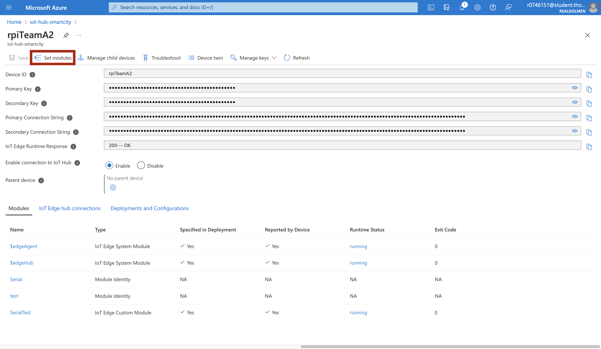
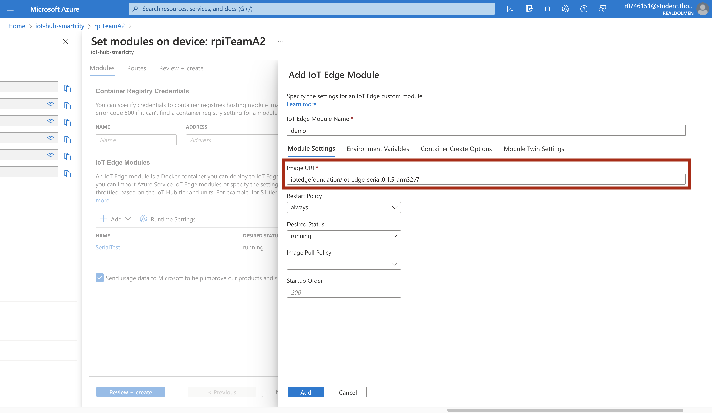
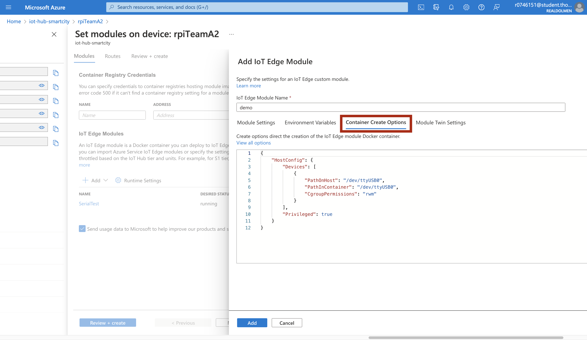
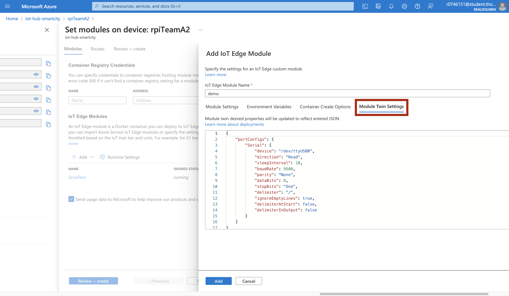
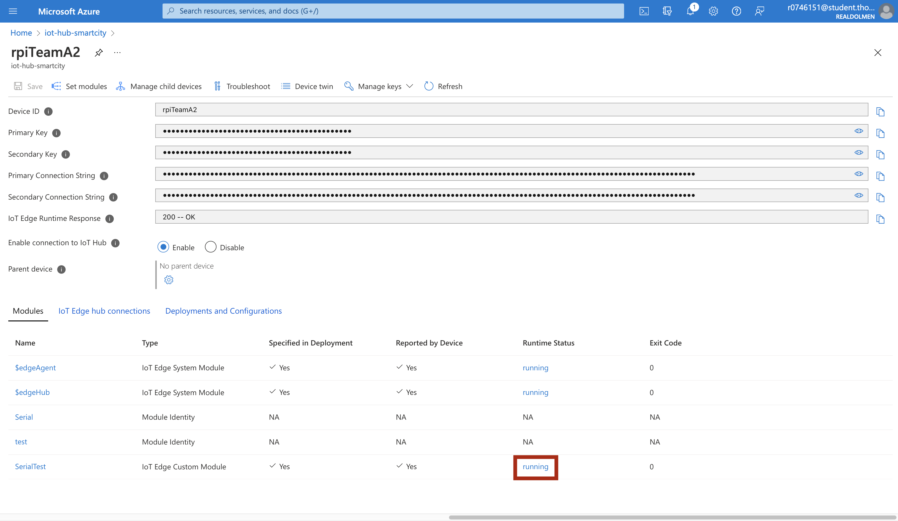
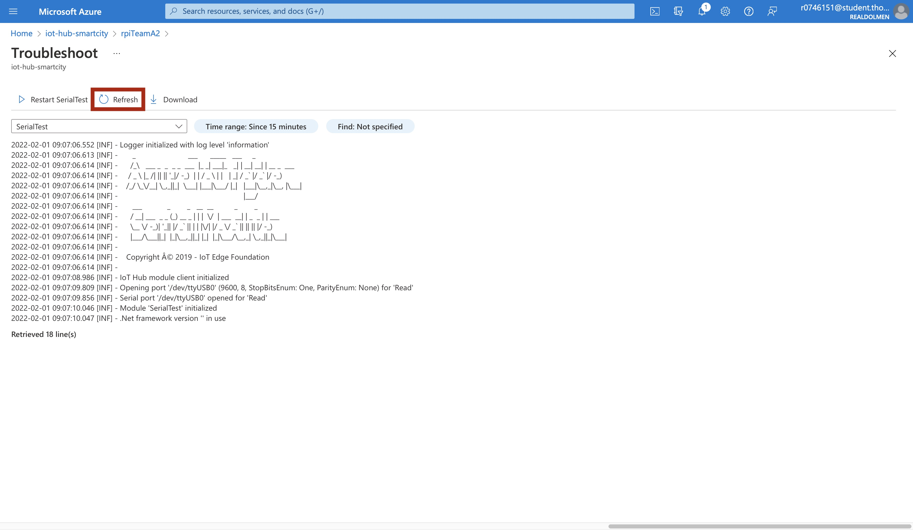

# How to deploy iot edge serial monitor module
This module can be deployed to forward Serial data to the iot-hub via the iot edge routes. 

**For more information:** <a href="https://github.com/iot-edge-foundation/iot-edge-serial">IoT edge serial monitor repo</a>

## What we need:
- running iot edge device
- serial connection with other device

## Find the suitable version for your device:
https://hub.docker.com/r/iotedgefoundation/iot-edge-serial/tags 

Arm32 was used for Raspberry Pi 4

## How to deploy:
### Go to *Set Module* 


### Add a new module, choose *IoT Edge Module*.


### Paste the URI in the image field.


### Configure *Container Create Options*.

Find usb device (disconnect device and reconnect device and see the changes):
```
ls /dev/tty*
```
Change permission of the usb device:
```
sudo chmod 666 /dev/tty*
```

Example of container create option:
```
{
    "HostConfig": {
        "Devices": [
            {
                "PathOnHost": "/dev/ttyXXX”,
                "PathInContainer": "/dev/ttyXXX”,
                "CgroupPermissions": "rwm"
            }
        ],
        "Privileged": true
    }
}
```



### Configure *Module Twin Settings*.
Example of Module twin settings:
```
{
    "portConfigs": {
        "Serial": {
            "device": "/dev/ttyUSB0",
            "direction": "Read",
            "sleepInterval": 10,
            "baudRate": 9600,
            "parity": "None",
            "dataBits": 8,
            "stopBits": "One",
            "delimiter": "/",
            "ignoreEmptyLines": true,
            "delimiterAtStart": false,
            "delimiterInOutput": false
        }
    }
}
```


## Check opperation of module:
Once the module is deployed and running you can check the logs.

Click running status of desired module:


Refresh logs if needed:


